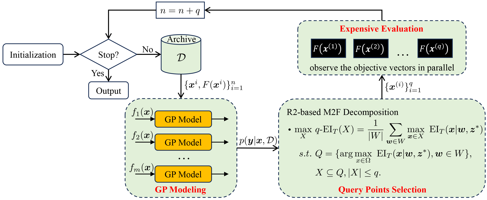

# R2/D-EGO

**This repository contains the Matlab code of R2/D-EGO.** 

> **Liang Zhao, Xiaobin Huang, Chao Qian, and Qingfu Zhang. Many-to-Few Decomposition: Linking R2-based and Decomposition-based Multiobjective Efficient Global Optimization Algorithms. IEEE Transactions on Evolutionary Computation, 2024.  [[PDF](https://ieeexplore.ieee.org/document/10612805)] [[Supplementary](https://ieeexplore.ieee.org/document/10612805/media#media)]**  

## Usage 

Matlab >= 2018a

### Quick Start

* The `run_R2D_EGO.m` provides the basic script to run experiments on ZDT and DTLZ.

### Advanced usage

* Download [PlatEMO](https://github.com/BIMK/PlatEMO) (version >=4.6, Matlab >= 2018a).
* Copy the folders within "**Algorithms**" into the directory at **"PlatEMO/Algorithms/"**. Next, add all of the subfolders contained within the "PlatEMO" directory to the MATLAB search path.
* In the MATLAB command window, type **`platemo()`** to run PlatEMO using the GUI.
* Select the label "**expensive**" and choose the algorithm **"R2D-EGO"**.
  * Default setting of `batch size`: 5.
* Select a problem and set appropriate parameters.
  * e.g., ZDT1, N=200, M=2, D=8, maxFE=200.

If you have any questions or feedback, please feel free to contact  liazhao5-c@my.cityu.edu.hk and qingfu.zhang@cityu.edu.hk.

## Citation
If you find our work is helpful to your research, please cite our paper.

## Acknowledgements
* This implementation is based on [PlatEMO](https://github.com/BIMK/PlatEMO).
* For GP modeling, we leverage the [DACE toolbox](https://www.omicron.dk/dace.html).
