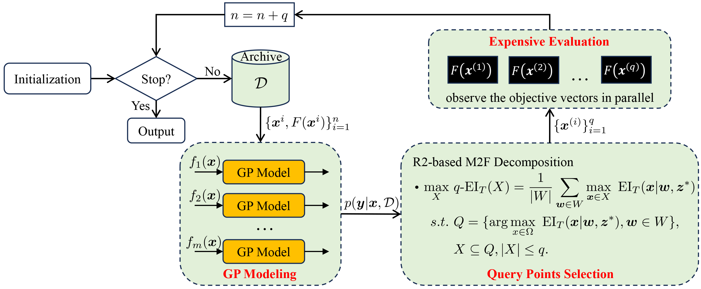

# R2/D-EGO

**This repository contains the Matlab code of R2/D-EGO.** 

> **Liang Zhao, Xiaobin Huang, Chao Qian, and Qingfu Zhang. Many-to-Few Decomposition: Linking R2-based and Decomposition-based Multiobjective Efficient Global Optimization Algorithms. IEEE Transactions on Evolutionary Computation, 29(5), 1873-1887, 2025.  [[Accepted Version](https://scholars.cityu.edu.hk/files/243001355/230319390.pdf)] [[PDF](https://ieeexplore.ieee.org/document/10612805)]** <br/>




## Usage 

Matlab >= 2018a

### Quick Start

* The `run_synthetic.m` provides the basic script to run experiments on ZDT and DTLZ.

### Advanced usage

* Download [PlatEMO](https://github.com/BIMK/PlatEMO) (version >=4.6, Matlab >= 2018a).
* Copy the folders within "**Algorithms**" into the directory at **"PlatEMO/Algorithms/"**. Next, add all of the subfolders contained within the "PlatEMO" directory to the MATLAB search path.
* In the MATLAB command window, type **`platemo()`** to run PlatEMO using the GUI.
* Select the label "**expensive**" and choose the algorithm **"R2D-EGO"**.
  * Default setting of `batch size`: 5.
* Select a problem and set appropriate parameters.
  * e.g., ZDT1, N=200, M=2, D=8, maxFE=200.


If you have any questions or feedback, please feel free to contact  liang.zhao@cityu.edu.hk and qingfu.zhang@cityu.edu.hk.


## Citation
If you find our work is helpful to your research, please cite our paper.

```
@article{zhao2025many,
  title={Many-to-few decomposition: Linking {R2}-based and decomposition-based multiobjective efficient global optimization algorithms},
  author={Zhao, Liang and Huang, Xiaobin and Qian, Chao and Zhang, Qingfu},
  journal={IEEE Transactions on Evolutionary Computation},
  year={2025},
  volume={29},
  number={5},
  pages={1873-1887},
  doi={10.1109/TEVC.2024.3434511}
  }
```


## Acknowledgements
* This implementation is based on [PlatEMO](https://github.com/BIMK/PlatEMO).
* For GP modeling, we leverage the [DACE toolbox](https://www.omicron.dk/dace.html).
